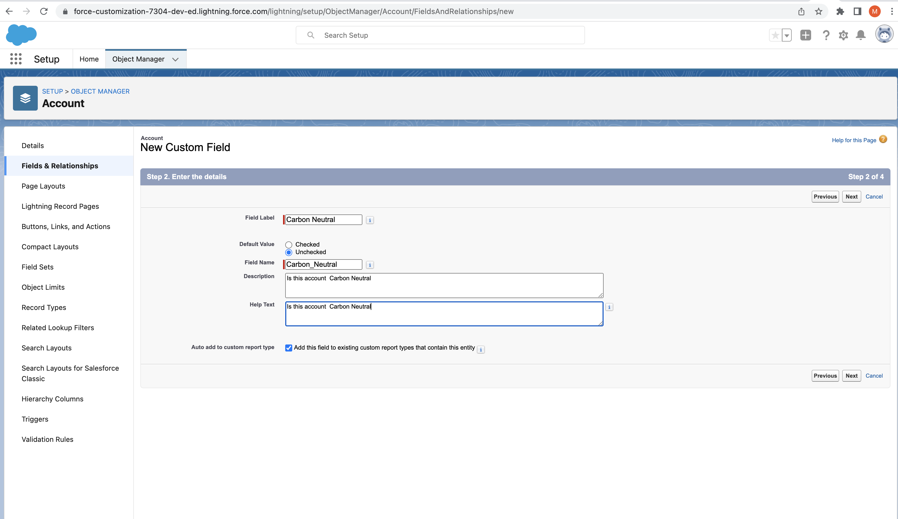

# Source Tracking

```
sfdx force:org:create -s -f config/project-scratch-def.json -a st -v mohan.chinnappan.n_ea2@gmail.com
(node:70514) [DEP0147] DeprecationWarning: In future versions of Node.js, fs.rmdir(path, { recursive: true }) will be removed. Use fs.rm(path, { recursive: true }) instead
(Use `node --trace-deprecation ...` to show where the warning was created)
Successfully created scratch org: 00D0R000000kk9nUAA, username: test-k4r4owweax2w@example.com

```

## Query
```

SELECT 
Id,
LastModifiedById,
CreatedById,


MemberName,	
MemberIdOrName,
MemberType,

RevisionCounter,
RevisionNum,

ChangedBy,

IsNameObsolete,
IsNewMember
	

FROM SourceMember
```

## Query SourceMember
```
sfdx mohanc:tooling:query -u st  -q ~/.soql/source-tracking.soql -f json
[]

```
## Open Org

```
~/devops-center/source-tracking/sourcetracking  >sfdx force:org:open -u st
Opening org 00D0R000000kk9nUAA as user test-k4r4owweax2w@example.com

Waiting to resolve the Lightning Experience-enabled custom domain...... done
```

## Add a field in Account
- 
## Check the source tracking - Source Member
```
~/devops-center/source-tracking/sourcetracking  >sfdx mohanc:tooling:query -u st  -q ~/.soql/source-tracking.soql -f json
[
    {
        "attributes": {
            "type": "SourceMember",
            "url": "/services/data/v54.0/tooling/sobjects/SourceMember/0MZ0R00000xJw4tWAC"
        },
        "Id": "0MZ0R00000xJw4tWAC",
        "LastModifiedById": "0050R00000CO3YdQAL",
        "CreatedById": "0050R00000CO3YdQAL",
        "MemberName": "Account.Carbon_Neutral__c",
        "MemberIdOrName": "00N0R00000egVPrUAM",
        "MemberType": "CustomField",
        "RevisionCounter": 1,
        "RevisionNum": 1,
        "ChangedBy": "0050R00000CO3Yd",
        "IsNameObsolete": false,
        "IsNewMember": true
    },
    {
        "attributes": {
            "type": "SourceMember",
            "url": "/services/data/v54.0/tooling/sobjects/SourceMember/0MZ0R00000xJw5IWAS"
        },
        "Id": "0MZ0R00000xJw5IWAS",
        "LastModifiedById": "0050R00000CO3YdQAL",
        "CreatedById": "0050R00000CO3YdQAL",
        "MemberName": "Admin",
        "MemberIdOrName": "00e0R000001ewRaQAI",
        "MemberType": "Profile",
        "RevisionCounter": 6,
        "RevisionNum": 6,
        "ChangedBy": "0050R00000CO3Yd",
        "IsNameObsolete": false,
        "IsNewMember": false
    },
    {
        "attributes": {
            "type": "SourceMember",
            "url": "/services/data/v54.0/tooling/sobjects/SourceMember/0MZ0R00000xJw4uWAC"
        },
        "Id": "0MZ0R00000xJw4uWAC",
        "LastModifiedById": "0050R00000CO3YdQAL",
        "CreatedById": "0050R00000CO3YdQAL",
        "MemberName": "Account-Account (Marketing) Layout",
        "MemberIdOrName": "00h0R000007tJSMQA2",
        "MemberType": "Layout",
        "RevisionCounter": 2,
        "RevisionNum": 2,
        "ChangedBy": "0050R00000CO3Yd",
        "IsNameObsolete": false,
        "IsNewMember": false
    },
    {
        "attributes": {
            "type": "SourceMember",
            "url": "/services/data/v54.0/tooling/sobjects/SourceMember/0MZ0R00000xJw4vWAC"
        },
        "Id": "0MZ0R00000xJw4vWAC",
        "LastModifiedById": "0050R00000CO3YdQAL",
        "CreatedById": "0050R00000CO3YdQAL",
        "MemberName": "Account-Account (Sales) Layout",
        "MemberIdOrName": "00h0R000007tJSNQA2",
        "MemberType": "Layout",
        "RevisionCounter": 3,
        "RevisionNum": 3,
        "ChangedBy": "0050R00000CO3Yd",
        "IsNameObsolete": false,
        "IsNewMember": false
    },
    {
        "attributes": {
            "type": "SourceMember",
            "url": "/services/data/v54.0/tooling/sobjects/SourceMember/0MZ0R00000xJw4wWAC"
        },
        "Id": "0MZ0R00000xJw4wWAC",
        "LastModifiedById": "0050R00000CO3YdQAL",
        "CreatedById": "0050R00000CO3YdQAL",
        "MemberName": "Account-Account (Support) Layout",
        "MemberIdOrName": "00h0R000007tJSOQA2",
        "MemberType": "Layout",
        "RevisionCounter": 4,
        "RevisionNum": 4,
        "ChangedBy": "0050R00000CO3Yd",
        "IsNameObsolete": false,
        "IsNewMember": false
    },
    {
        "attributes": {
            "type": "SourceMember",
            "url": "/services/data/v54.0/tooling/sobjects/SourceMember/0MZ0R00000xJw4xWAC"
        },
        "Id": "0MZ0R00000xJw4xWAC",
        "LastModifiedById": "0050R00000CO3YdQAL",
        "CreatedById": "0050R00000CO3YdQAL",
        "MemberName": "Account-Account Layout",
        "MemberIdOrName": "00h0R000007tJSPQA2",
        "MemberType": "Layout",
        "RevisionCounter": 5,
        "RevisionNum": 5,
        "ChangedBy": "0050R00000CO3Yd",
        "IsNameObsolete": false,
        "IsNewMember": false
    }
]
```
